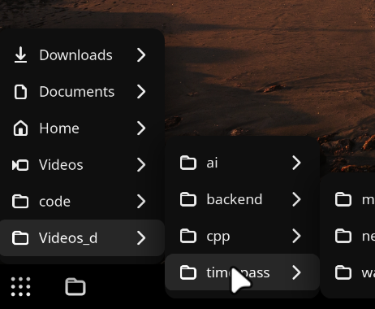

# 📁 Files Dropdown (GNOME Shell Extension)



A lightning-fast, highly customizable GNOME Shell extension that brings
your file system and bookmarks directly to the top panel.

Navigate deeply nested directories through fluid, cascading menus
without ever opening a separate file manager window. Built from the
ground up for modern GNOME (45+) with asynchronous file fetching and
hardware-accelerated animations.

## ✨ Features

-   **Seamless Navigation:** Infinite cascading submenus to browse your
    entire file system directly from the panel.
-   **Smart Integration:** Automatically loads your GTK/Nautilus
    Bookmarks and Home directory by default.
-   **Zero Lag:** Uses asynchronous `Gio` file enumeration. Even folders
    with thousands of files won't freeze your GNOME Shell.
-   **Smart Positioning:** Submenus automatically detect monitor edges
    and dynamically adjust their opening direction (left/right) to keep
    your files on-screen.
-   **Native Interactions:**
    -   **Left-Click:** Opens the file or folder in your default
        application.
    -   **Right-Click:** Opens the item's Properties dialog (allowing
        access to the **Open With** menu).
-   **Deep Customization:** Features a modern Libadwaita preferences
    window allowing you to customize:
    -   Dimensions, padding, and margins.
    -   Typography (integration with native GNOME font dialog).
    -   Colors, opacities, and hover state animations.
    -   Menu positioning, offsets, and drop shadows.
    -   Open/Close delays and transition speeds.

## 📦 Installation

### Method 1: GNOME Extensions Website (Recommended)

The easiest way to install is directly from the GNOME Extensions
website:

1.  Go to **Files Dropdown** on **extensions.gnome.org** *(Note: Link
    will be active once approved).*
2.  Toggle the switch to **ON**.

### Method 2: Manual Installation (GitHub)

If you want to test the latest features or install from source:

``` bash
git clone https://github.com/vaibhavpatidar0079/files-dropdown.git ~/.local/
```

``` bash
cd ~/.local/share/gnome-shell/extensions/files-dropdown@vaibhavpatidar0079.g
```

``` bash
glib-compile-schemas schemas/
```

Restart GNOME Shell:

-   **Wayland:** Log out and log back in.
-   **X11:** Press `Alt + F2`, type `r`, and press `Enter`.

Enable the extension via the **Extensions** app or **GNOME Tweaks**.

## ⚙️ Compatibility

-   **GNOME Shell:** 45, 46, 47, 48, 49, 50
-   **Architecture:** Uses modern ECMAScript Modules (ESM) required by
    GNOME 45+.

## ❤️ Contributing

Contributions, issues, and feature requests are welcome! Feel free to
check the issues page.

1.  Fork the Project
2.  Create your Feature Branch

``` bash
git checkout -b feature/AmazingFeature
```

3.  Commit your Changes

``` bash
git commit -m 'Add some AmazingFeature'
```

4.  Push to the Branch

``` bash
git push origin feature/AmazingFeature
```

5.  Open a Pull Request

## 📝 License

Distributed under the GNU General Public License v3.0.
